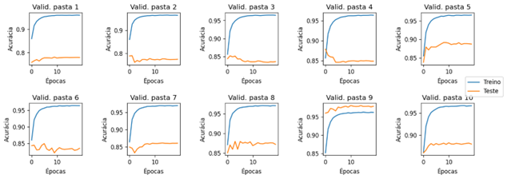
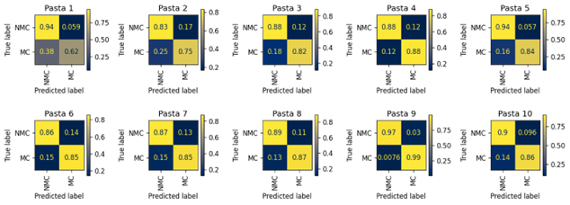
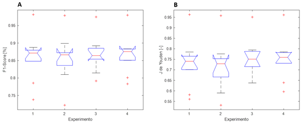

# Detector de motores a combustão por meio de análise sonora através de uma rede neural.

## PT-BR, texto original. [Trabalho completo](./TCC%20-%20MBA%20USP%20ESALQ_MatheusSozza_VersaoFinal_V04_RevME.pdf)

### Resumo

O atual cenário tecnológico da computação nos provê com grande capacidade de coleta e armazenamento de informações, seja de maneira local ou na nuvem, ao mesmo tempo em que a evolução dos computadores incrementou de maneira exponencial a capacidade de processamento intensivo de todo tipo de dado no geral. Ao aliar essas características com técnicas modernas de aprendizado de máquina temos a possibilidade de extrair de tais dados informações que, a priori, são humanamente imperceptíveis, porém agregam valor e ajudam a direcionar a análise da informação ali contida, no caso do presente trabalho, como um classificador de amostras sonoras. Para tal, foi utilizada uma base de dados sonoros e previamente rotulados disponível na internet (UrbanSound8k), sob a qual diversos trabalhos científicos já foram realizados. No caso do presente trabalho foi proposta uma análise de segmentos sonoros dos quais extraíram-se os espectrogramas de frequências que serviram como entradas para um treinamento supervisionado através de uma rede neural convolucional, com o objetivo de classificar se o segmento sonoro em questão possui o som de um motor a combustão em funcionamento ou não, sendo, portanto, uma classificação binária. A classificação apresentou performance alta com base nos índices F1-Score e J de Youden e contribuiu relevantemente para direcionar futuros trabalhos de reconhecimento e classificação de áudio voltados à indústria automotiva, seja na melhoria das emissões, controle de tráfego ou mesmo para diagnóstico automatizado das partes mecânicas.

**Palavras-chave**: Redes Neurais, Motores à combustão, Diagnóstico Veicular, Classificação.

### Introdução

Introdução

Motores a combustão são sistemas muito presentes no cotidiano dado sua extensa aplicabilidade e o fato de ser uma tecnologia há muito tempo conhecida   e cujo fenômeno base, a combustão, é dominada com robustez pela indústria.
Ao mesmo tempo, é sabido que apesar da relevância que esses dispositivos possuem, existem alguns pontos contra notáveis, como a poluição atmosférica e consequente potencialização do efeito estufa e aquecimento global, além dos riscos à saúde das pessoas expostas direta e prolongadamente aos poluentes emitidos pelo escapamento (Nikischer, 2020).
Fazendo uso dos padrões sonoros do motor é possível extrair informações a respeito da sua performance de operação, o que permite julgar se o dispositivo está em funcionamento, operando corretamente, e até mesmo diagnosticar falhas em partes específicas, como citado em Wu. Z. et al., (2022). Atualmente o diagnóstico de falhas é subjetivo e altamente correlacionado à expertise do técnico mecânico responsável pela avaliação e manutenção do veículo, o que resulta em baixo nível de sucesso, havendo então uma oportunidade de melhoria desse processo por meio de algoritmos inovadores (Kemalkar e Bairagi, 2016).
Outra possível utilização de dados sonoros de motores é aquela voltada à geração de estatísticas de tráfego e planejamento de demanda, ou até mesmo no controle de semáforos baseado em situações especiais, como a presença de veículos de emergência (ambulâncias), como destacado em Analytics Vidhya (2022). Dados extraídos num contexto de Big-Data têm sido cada vez mais utilizados no âmbito das cidades inteligentes (Smart-Cities), auxiliando no planejamento e gestão do tráfego das zonas rural e urbana (Zhao, Y. et al., 2018).
Mohammadi e Al-Fuqaha (2018) enunciam que, apesar das altas capacidades de coleta e armazenamento de dados dos sistemas computacionais atuais, muito pouco se aproveita da informação ali contida, com métodos tradicionais baseados apenas em análise temporal, os quais negligenciam a presença de padrões valorosos contidos nos dados armazenados e que não visíveis diretamente numa análise por amostras. Por outro lado, o uso de redes neurais profundas (DNN ou Deep Neural Networks) se mostra uma alternativa válida e promissora para a extração de informações perspicazes do ponto de vista analítico.
Outro ponto enunciado por Mohammadi e Al-Fuqaha (2018) é o fato de que, uma vez que os dados são coletados e armazenados, é improvável que venham a ser reutilizados no futuro, encorajando-se o processamento imediato.
O presente trabalho visa demonstrar como é possível classificar amostras de sons em categorias definidas por meio do processamento intensivo e supervisionado dos dados através redes neurais convolucionais [CNNs], mesmo quando os padrões e métricas a se extrair não são observáveis ou perceptíveis a priori para um processamento através de algoritmos tradicionais e explicáveis, os quais se baseiam em regras pré-estabelecidas e modelagem baseada puramente em premissas matemáticas. (Bhatia, 2018).   

---

# Combustion Engine Detector Using Sound Analysis Through a Neural Network

## EN-US - Translated by AI algorithm, not reviewed.

### Abstract

The current technological scenario of computing provides us with a great capacity for acquiring and storing information, either locally or in the cloud, while the evolution of the computers has exponentially increased the processing capacity of all types of data in general. By combining these characteristics with modern machine learning techniques, we have the possibility of extracting data information that, in principle, is imperceptible to humans but adds value and helps to guide the analysis of the information contained therein, in the case of this work, as a sound sample classifier. For this purpose, a sound database that was previously labeled and available on the internet (UrbanSound8k) was used, under which several scientific works have already been carried out. In the case of this work, an analysis of sound segments was proposed, from which frequency spectrograms were extracted and served as inputs for supervised training through a convolutional neural network, with the objective of classifying whether the sound segment in question has the sound of a running combustion engine or not, performing a binary classification. The trained model presented a good performance based on the metrics F1-Score and Youden’s J statistic, contributing relevantly to open doors for future sound recognition and classification research aimed at the automotive industry, either in improving emissions, traffic control, or even for automated diagnosis of mechanical parts.

**Keywords**: Neural Networks, Combustion Engines, Vehicle Diagnostics, Classification.

### Introduction

Combustion engines are systems widely present in daily life due to their extensive applicability and the fact that it is a long-known technology whose fundamental phenomenon, combustion, is robustly mastered by the industry.

At the same time, it is known that despite the relevance of these devices, there are some notable downsides, such as atmospheric pollution and the consequent exacerbation of the greenhouse effect and global warming, as well as health risks to people exposed directly and prolonged to exhaust pollutants (Nikischer, 2020).

By using engine sound patterns, it is possible to extract information about its operational performance, which allows judging whether the device is functioning, operating correctly, and even diagnosing faults in specific parts, as mentioned in Wu. Z. et al., (2022). Currently, fault diagnosis is subjective and highly correlated with the expertise of the mechanic responsible for the vehicle's evaluation and maintenance, resulting in a low level of success, thus presenting an opportunity to improve this process through innovative algorithms (Kemalkar and Bairagi, 2016).

Another possible use of engine sound data is for generating traffic statistics and demand planning, or even controlling traffic lights based on special situations, such as the presence of emergency vehicles (ambulances), as highlighted in Analytics Vidhya (2022). Data extracted in a Big-Data context has increasingly been used in the realm of smart cities, aiding in the planning and management of rural and urban traffic (Zhao, Y. et al., 2018).

Mohammadi and Al-Fuqaha (2018) state that despite the high data collection and storage capacities of current computer systems, very little is taken advantage of from the information contained therein, with traditional methods based only on temporal analysis, which neglect the presence of valuable patterns contained in stored data that are not directly visible in a sample analysis. On the other hand, the use of deep neural networks (DNN or Deep Neural Networks) is a valid and promising alternative for extracting insightful information from an analytical point of view.

Another point made by Mohammadi and Al-Fuqaha (2018) is that once data is collected and stored, it is unlikely to be reused in the future, encouraging immediate processing.

The present work aims to demonstrate how it is possible to classify sound samples into defined categories through intensive and supervised processing of the data using convolutional neural networks (CNNs), even when the patterns and metrics to be extracted are not observable or perceptible a priori for processing through traditional and explainable algorithms, which are based on pre-established rules and purely mathematical premise-based modeling (Bhatia, 2018).

---

# Algumas imagens e resultados / Some images and results

[Análise completa / Full analysis.](./TCC%20-%20MBA%20USP%20ESALQ_MatheusSozza_VersaoFinal_V04_RevME.pdf)

## Exp.1

## Exp.2

## Exp.3

## Exp.4

## Boxplot 
